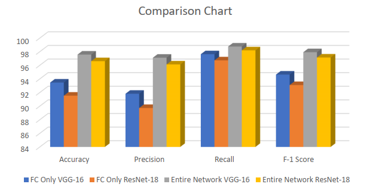

# MSDS19087_COVID19_DLSpring2020
This repository contains code and results for COVID-19 classification assignment by Deep Learning Spring 2020 course offered at Information Technology University, Lahore, Pakistan. This assignment is only for learning purposes and is not intended to be used for clinical purposes.

### Dataset Link: 
You can download dataset from [here](https://drive.google.com/open?id=1-HQQciKYfwAO3oH7ci6zhg45DduvkpnK "Dataset Link")
### Trained Models Link: 
* You can download all trained models from [here](https://drive.google.com/open?id=13udumKPezxW8bQp4LJc1HoToKzhp4_OR)
* Task 1 (Only Fully-connected on VGG-16): You can download model from [here](https://drive.google.com/open?id=1xKddrC4ONzry7hKutvkCgl3H-s5dJvuZ)
* Task 1 (Only Fully-connected on ResNet-18): You can download model from [here](https://drive.google.com/open?id=1-7X0q8F_xqOAdHz-8jVleRm60_78-Gfq)
* Task 2 (Training entire VGG-16 newtwork): You can download model from [here](https://drive.google.com/open?id=1-N6Lg4MxLf9bnxNcNufQkJ0BHavTkG8W)
* Task 2 (Training entire ResNet-18 newtwork): You can download model from [here](https://drive.google.com/open?id=1-QJ40o5zTgLkY_ZqwLS8z5VSasYbO7xz)

## Task description and approach used:
  World is suffering from a global pandemic caused by a virus named Covid-19. Its symptoms are much similar to other diseases like viral flu, or SARS, or pneumonia. In this assignment we were given a dataset of 15,000 X-Ray images. These images are labeled as ‘Normal’ and ‘Infected’. What we have to do is to train a model that learn normal X-Ray images and differentiate it with Infected X-Ray images. For this task we used well known deep learning library named as ‘Pytorch’. We also used pre-trained VGG-16 and ResNet-18 models, trained on ImageNet for training of model.
## Results:
### Task 1: Training only Fully connected Layers
#### VGG-16 Testing	Accuracy = 93.46
#### VGG-16 Confusion Matrix

#### ResNet-18 Testing	Accuracy = 91.53
#### ResNet-18 Confusion Matrix

### Task 2: Training entire network
#### VGG-16 Testing	Accuracy = 97.57
#### VGG-16 Confusion Matrix

#### ResNet-18 Testing	Accuracy = 96.60
#### ResNet-18 Confusion Matrix

## Predicted Results

## Comparison of Results
From following results we can see when we trained only fully connected layers of model and used pre-trained convolution layers (on ImageNet) then we got less accurate scores in comparison to when we trained entire network on current (Covid-19) dataset. That is because models were pre-trained on ImageNet that doesn’t contain X-Ray like images. Model gives good accuracy without training it on entire network as it already knows how to learn different details in images. We can see in both cases VGG-16 is slightly better than ResNet-18 (in ImageNet ResNet-18 is slightly better). ResNet-18 took slightly less time to train, in comparison to VGG-16.
#### Comparison Table

#### Comparison Chart

